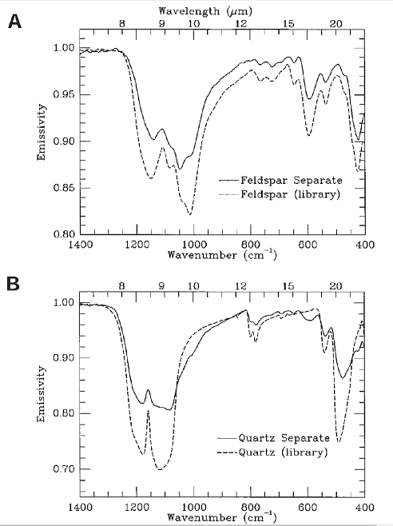
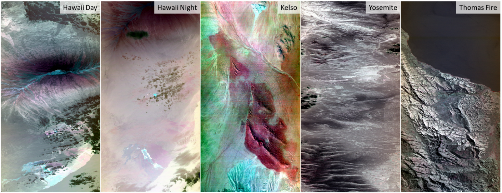
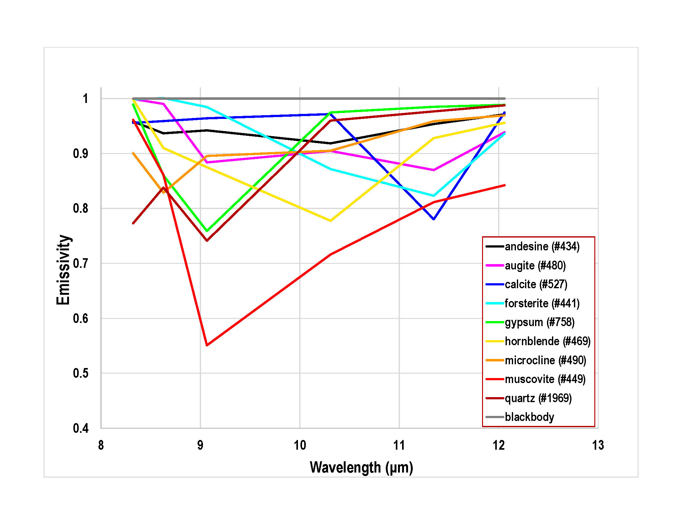
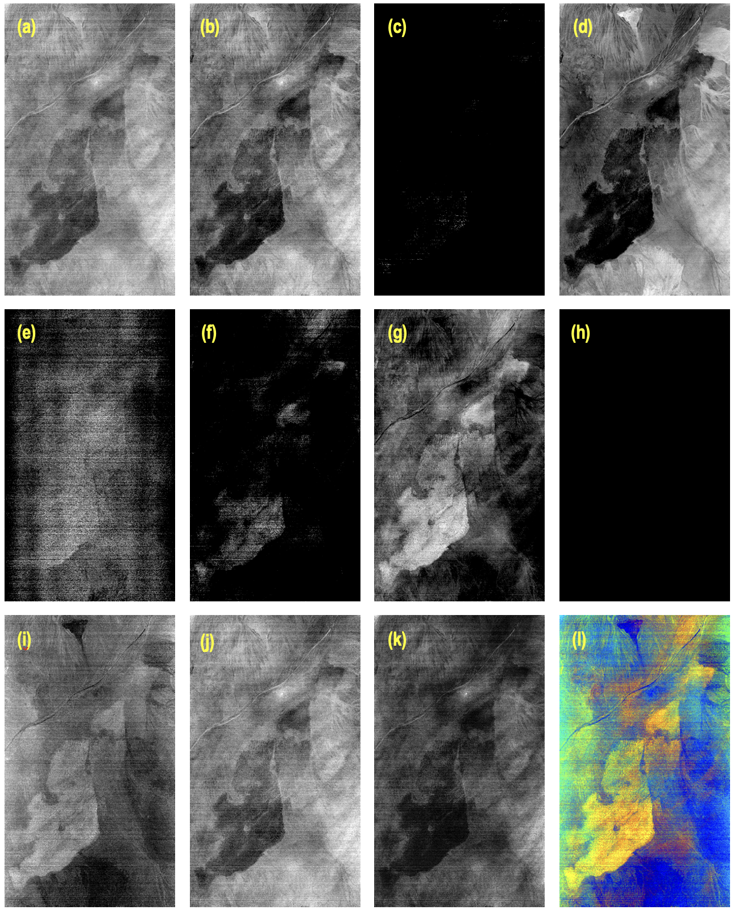

# Surface Biology and Geology (SBG) Observing Terrestrial Thermal Emission Radiometer (OTTER)

## SBG-TIR OTTER Level 3 Surface Mineralogy (L3-SM) Data Product Algorithm

[Michael S. Ramsey](https://github.com/michaelsramsey) 
[mramsey@pitt.edu](mailto:mramsey@pitt.edu) 
University of Pittsburgh

[James O. Thompson](https://github.com/jthompson2710) 
[james.thompson@beg.utexas.edu](mailto:james.thompson@beg.utexas.edu) 
University of Texas Austin

Federico Rabuffi (he/him) 
[federico.rabuffi@jpl.nasa.gov](mailto:federico.rabuffi@jpl.nasa.gov) 
NASA Jet Propulsion Laboratory 329A

##  1. Introduction

This repository will gradually expand to contain the Surface Biology and Geology Thermal Infrared (SBG-TIR) OTTER level 3 surface mineralogy (L3-SM) data product algorithm.

This document outlines the theory and methodology for generating the OTTER Level-3 (L3) surface mineralogy (SM) product. The SM product uses the L2 TIR surface emissivity data as input together with a spectral library of the most common Earth surface minerals acquired in emission in the laboratory at 2 cm^-1^ resolution (Christensen et al., 2000). Most silicates, carbonates, and other rock-forming minerals have diagnostic spectral features in the TIR regions characterized by the strongest absorption bands also known as Reststrahlen features (Figure 1). The SM algorithm uses the principal of linear spectral mixing in TIR region where the larger absorption coefficients typical of most rock-forming minerals limit photon transmission and scattering within the mineral grains. The emitted spectrum, therefore, has spectral features in linear proportion to the areal abundance of those minerals in the unknown sample (Ramsey and Christensen, 1998). In contrast, this scattering is more prevalent in the visible short-wave infrared (VSWIR) causing non-linearity in the reflectance spectrum and requiring more complex mapping approaches to mineral identification (Clark et al., 2003, Connelly et al., 2021).

The SM product is applied to the at-surface TIR emissivity data derived from the L2 land surface temperature and emissivity (LSTE) product. It will be applied to a limited subset of OTTER data determined using a seasonally adjusted global emissivity mask (e.g., Hulley et al., 2015). Only OTTER data with an average emissivity of \< 0.92 (avoiding significant vegetation cover) and an average temperature \> 0 C (avoiding snow and ice), which corresponds to \~ 30% of the Earth's land surface, will be mapped using the SM algorithm. The emission spectrum from any pixel meeting these criteria is modeled using the pre-determined spectral library as input and producing a best-fit suite of mineral endmember images plus their corresponding residual error images. A root-mean-squared (RMS) error image is also produced to assess the overall goodness-of-fit of the model. Finally, a weight percent silica (WPS) image is also produced using the approach of Hook et al. (2005).

*Figure 1: TIR (8.0 – 13.0 µm) spectral emissivity of quartz and microcline (potassium feldspar) showing the diagnostic Reststrahlen emissivity features for both minerals. The inclusion of a sixth TIR band at ~ 10.3 mm allows better discrimination of these primary rock-forming minerals using the SM algorithm. Data from: ASU Spectral Library (Christensen et al., 2000).*
 
The SM data will be assessed and validated throughout the mission using pseudo-invariant sand dune sites in the Western United States, Africa, and China (Hulley and Baldridge, 2013; Helder et al., 2010). Sand dunes present ideal calibration sites for TIR emissivity-based compositional studies because they have well-mixed, unimodal surfaces with low percentages of vegetation and shadows (Ramsey et al., 1999; Scheidt and Ramsey, 2010; Scheidt et al., 2011).

The remainder of the document will discuss the SBG instrument characteristics, provide a background on TIR remote sensing, give a full description and background on the SM algorithm, provide quality assessment, discuss numerical simulation studies and, finally, outline a validation plan.

## 2. Data Products

### 2.1. Metadata

SBG-TIR standards incorporate additional metadata that describe each GeoTIFF Dataset within the GeoTIFF file. Each of these metadata elements appear in an GeoTIFF Attribute that is directly associated with the GeoTIFF Dataset. Wherever possible, these GeoTIFF Attributes employ names that conform to the Climate and Forecast (CF) conventions. 

Each SBG product bundle contains two sets of product metadata:
-   ProductMetadata
-   StandardMetadata

#### 2.1.1. Standard Metadata
Information on the `StandardMetadata` is included on the [SBG-TIR github landing page](https://github.com/sbg-tir)

#### 2.1.2. Product Metadata

### 2.2. Scientific Data Set (SDS) Variables

|  **SDS** |    **Long Name**    |   **Data type** |  **Units**  | **Valid Range** |  **Fill Value** |  **Scale Factor**  | **Offset** | **Group** | **SDS** |
|  Amph% |      Amphibole Percentage       |       Int8  |          %   |       1-255   |          0    |
|  Carb%  |     Carbonate Percentage       |       Int8    |        %  |        1-255    |         0     |
|  Mica%   |    Mica Percentage            |       Int8   |         %   |       1-255     |        0    |
|  Oliv%    |   Olivine Percentage        |        Int8    |        %    |      1-255      |       0    |
|  Plag% |      Plagioclase Feldspar Percentage  | Int8     |       %   |       1-255       |      0   |
|  Kspr%  |     Potassium Feldspar Percentage    | Int8      |      %   |       1-255  |           0  |
|  Pyrx%   |    Pyroxene Percentage    |           Int8  |          %   |       1-255   |          0   |
|  Qrtz%    |   Quartz Percentage       |          Int8   |         %    |      1-255    |         0  |
|  Gyps%    |   Gypsum Percentage        |         Int8    |        %   |       1-255     |        0   |
|  Bb%      |   Blackbody Percentage      |        Int8     |       %     |     1-255      |       0    |                               
|  TIR1-res |   TIR Band 1 Residual Error  |       Float16   |      n/a   |     0-65535     |      0     |                              
|  TIR2-res |   TIR Band 2 Residual Error   |      Float16    |     n/a   |      0-65535     |      0      |                             
|  TIR3-res  |  TIR Band 3 Residual Error    |     Float16     |    n/a   |      0-65535      |     0       |                            
|  TIR4-res  |  TIR Band 4 Residual Error     |    Float16 |        n/a   |      0-65535       |    0    |
|  TIR5-res  |  TIR Band 5 Residual Error   |      Float16  |       n/a   |      0-65535        |   0     |                              
|  TIR6-res  |  TIR Band 6 Residual Error    |     Float16   |      n/a   |      0-65535   |        0  |
|  RMS-err   |  RMS Error        |                 Float16    |     n/a   |      0-65535    |       0   |
|  WPS      |   Wt% silica        |                Float16     |    %     |     0-65535      |     0  |
|  QC       |   Data Quality       |               Int8         |   n/a   |      1-255        |     0 |

*Table 2. The Scientific Data Sets (SDSs) for the L3 SBG Surface Mineralogy (SM) product*

## 3. Theory

### 3.1. Mid-wave and Thermal Infrared Remote Sensing Background

The at-sensor measured radiance in the infrared region (3--13 µm) consists of a combination of different terms from surface emission, solar reflection, and atmospheric emission and attenuation. The Earth-emitted radiance is a function of the temperature and emissivity of the surface, which is then attenuated by the atmosphere on its path to the satellite. The emissivity of an isothermal, homogeneous emitter is defined as the ratio of the actual emitted radiance to the radiance emitted from a blackbody (Figure 1) at the same thermodynamic temperature (Norman and Becker 1995), ϵλ= R~λ~/B~λ~. Emissivity is an intrinsic property of the surface material and is an independent measurement from the surface temperature, which varies with irradiance, local atmospheric conditions, time of day, and specific conditions causing elevated temperature (e.g., wildfires, volcanic eruptions, etc.). The emissivity of most natural Earth surfaces varies from \~0.7 to close to 1.0, for the TIR wavelength (8--13 μm) for spatial scales \<100 m. Narrowband emissivities less than 0.85 are typical for most desert and semi-arid areas due to the strong quartz absorption feature (Reststrahlen band) between the 8.0 and 9.5 μm, whereas the emissivity of green vegetation and water are generally greater than 0.95 and spectrally flat in the TIR. Dry and senesced vegetation as well as ice and snow can have lower emissivity values in the wavelengths longer than 10 μm.

The atmosphere also emits TIR radiation, a percentage of which reaches the sensor directly as \"path radiance,\" whereas some amount is radiated downward to the surface (irradiance) and reflected back to the sensor. This is commonly known as the reflected downwelling sky irradiance. One effect of the sky irradiance is the reduction of the spectral contrast of the emitted surface radiance, due to Kirchhoff\'s law. Assuming the spectral variation in emissivity is small (Lambertian assumption) and using Kirchhoff\'s law to express the hemispherical-directional reflectance as directional emissivity (ρ~λ~=1-ϵ~λ~), the at-sensor measured radiance in the infrared spectral region is a combination of three primary terms: the Earth-emitted radiance, reflected downwelling radiance (thermal + solar components), and total atmospheric path radiance (thermal + solar components).

The Temperature Emissivity Separation (TES) Algorithm originally created for ASTER TIR (Gillespie et al., 1998) data will be used to derive surface temperature and emissivity from the OTTER radiance data. The algorithm combines and improves upon some core features from previous temperature emissivity separation algorithms. TES combines the normalized emissivity method (NEM), the ratio, and the minimum-maximum difference (MMD) algorithm to retrieve temperature and a full emissivity spectrum. The NEM algorithm is used to estimate temperature and iteratively remove the sky irradiance, from which an emissivity spectrum is calculated, and then ratioed to their mean value in the ratio algorithm. At this point, only the shape of the emissivity spectrum is preserved, but not the amplitude. In order to compute an accurate temperature, the correct amplitude is then found by relating the minimum emissivity to the spectral contrast (MMD). Once the correct emissivity values are found, a final temperature can be calculated with the maximum emissivity value. Additional improvements involve a refinement of $\epsilon_{\max}$ in the NEM module and refining the correction for sky irradiance using the $\varepsilon_{\min}$-MMD final emissivity and temperature values. Numerical modeling studies showed that TES can recover temperatures to within 1.5 K and emissivity values to within 0.015 over most scenes, assuming well calibrated, accurate radiometric measurements with a minimum of noise (Gillespie et al. 1998).

### 3.2.  Compositional Detection in the TIR

The emission spectra from laboratory samples or pixels in a TIR image that are comprised of more than one mineral reflect those mineral endmembers by a combination of their characteristic spectral features. Perhaps more importantly, under most circumstances, those features are a linear combination of the areal percentage of the mineral endmembers themselves (Figure 2). The assumption of linear mixing of thermal radiant energy is valid due to the fact that most geologically significant minerals have very high absorption coefficients in the TIR, resulting in a much shorter path length and less scattering for the emitted photons. As a result, the majority of the energy detected by a sensor has interacted with only one surface particle (Ramsey and Christensen, 1998, *REFS*).

*Figure 2: Emission spectra of the best-case separation of feldspar and quartz derived from the heavy-liquid technique. (A) Feldspar. (B) Quartz. Each spectrum is plotted with a pure library end member for comparison. From Ramsey and Christensen (1998).*

Upon mixing, the spectral features from surface particles are retained in proportion to their areal extent. For example, Ramsey and Christensen (1998) showed this in spectra from Kelso Dunes, CA. The individual mineral grains in sand samples were separated using a heavy liquid technique, which proved to be only partially successful (Figure 2). Contamination of each spectrum by the other mineral is visible in the spectral features being most evident in the quartz spectrum, where 34% feldspar still remained. This contamination shows as a reduction in contrast of the primary absorption band at 1150 cm^-1^, the development of band shoulder at 1000 cm^-1^, and several smaller absorption bands between 600 cm^-1^ and 700 cm^-1^.

#### 3.2.1. Spectral Mixture Analysis (SMA)

This allows for a relatively straight forward approach to spectral analysis using some variation of linear spectral mixture analysis (Heinz 2001; Somers et al. 2011; Tompkins et al. 1997). 
 
Assuming that the pure mineral spectra (i.e., the endmembers) are known, TIR spectra can be linearly deconvolved using the least-squares approach (equation 2) to ascertain the mineralogic percentages. For image-based analyses, this results in one image per endmember together with several checks on the accuracy of that model fit. A residual error image is produced for each TIR band, which is simply the measured -- the modeled emissivity in that spectral band. Areas of high residual error indicate a poor model fit in that spectral band with the chosen endmembers. This difference is a critical measure of the retrieval algorithm\'s fit, and easily visualized where displayed versus wavelength, or as an image in the case of remotely gathered data (Gillespie et al., 1990). High residual errors at specific wavelengths indicate the possibility of an unmodeled absorption feature not present in either the endmember or mixture spectrum. An examination of residuals may also reveal nonlinear behavior at certain wavelengths as well as highlight areas of poor atmospheric correction and/or low instrument signal to noise (SNR).

A singular goodness-of-fit error image is also produced for each image/model run. The root-mean-squared (RMS) error image becomes invaluable in order to assess the overall quality of a given algorithm iteration. For an instrument with (m) wavelength bands, the RMS is related to the per-band residual error (δ(λ)).

In the most common approach to spectral deconvolution, the number of endmembers modeled must be ≤ the number of spectral bands. Thus, for hyperspectral data, the number of possible endmembers can be quite high (to the point of being geologically implausible). However, for multispectral data, the limited number of spectral bands commonly places a tight constraint on the number of endmembers. This constraint may be acceptable if one is modeling the highest percentage two or three mineral endmembers using five or six band TIR data. If more than five or six endmember are present (or if one wants to test for the presence of many unknown minerals), a different approach is required such as the Multiple Endmember SMA (MESMA), which uses a combinatorial approach to testing all possible endmember combinations for the one producing the best fit (e.g., the lowest RMS error).

#### 3.2.2. Multiple Endmember SMA (MESMA)

Linear SMA assumes that a mixed spectrum can be modeled as a linear combination of pure spectra, known as endmembers (Adams et al., 1986; Ramsey and Christensen, 1998). Under ideal conditions, the most accurate fractional estimates can be achieved using the minimum number of endmembers required to account for spectral variability within a mixed pixel (Sabol et al. 1992). Fractional errors occur either where too few endmembers are used, resulting in spectral information not modeled by the existing endmembers; or too many, resulting in incorrect endmember assignment that is used in the model, but not actually present (Roberts et al., 1998). The iterative Multiple Endmember Spectral Mixture Analysis (MESMA) technique can account for within-class variability and is applied by running numerous models for a pixel and selecting one model based on its ability to meet selection criteria and produce the best fit, typically a minimum RMS (Painter et al. 1998). Selection criteria include fractional constraints (minimum and maximum fraction constrains), maximum allowable blackbody fraction, RMSE constraints and a residual constraint set to remove any model that exceeds a threshold over a range of wavelengths. Using this approach, pixel-scale limits in spectral dimensionality are recognized despite the considerable spectral variability within a scene. The model constraints are variably selectable, whereby MESMA can also be run in an unconstrained mode. Previous studies have found that the flexible MESMA approach resulted in the majority of pixels in an image being modeled with only two-endmember models (Roberts et al. 1998). For example, Powell and Roberts (2008) found that natural landscapes in Brazil required only two-endmember models, disturbed regions required three- and urban areas required four-endmember models.

## 4. Surface Mineralogy (SM) Algorithm

The surface mineralogy (SM) algorithm for SBG must rapidly and accurately detect mineral abundances across Earth's low vegetation surfaces (i.e., dunes, volcano, wildland fire scars, arid regions) with a low RMSE. Two main groups of algorithms were tested: SMA and MESMA, based on the widespread usage in the community and previous development and refinement activities. The testing approach and the results are first described below with the final SM algorithm implementation presented in §4.4.2 and §4.5.

### 4.1. Test Data Creation

Five simulated OTTER datasets were created from airborne MASTER data using the pre-existing MASTER wavelengths or weighted band averages for the OTTER band center positions that did not align with those of MASTER (Figure 3). The data were also spatially resampled to the planned resolution of OTTER and the atmospheric correction was modified for the performance characteristics (e.g., FPA response) and viewing geometry of OTTER. These simulated data were chosen to test many of the SBG geology higher level data products and therefore include data with known thermal anomalies others with no thermally elevated areas. The latter included compositionally varied targets (e.g., Kelso Dunes, Yosemite National Park) for testing the Surface Mineralogy (SM) product algorithms. However, here they served as null test locations for the ETF algorithm. Both day and night time datasets were utilized.

*Figure 3. False color image data (11.35, 9.07, 8.32 µm: RGB) of the simulated OTTER data used in the ETF algorithm testing process.*

### 4.2. Algorithm Testing Criteria

Two main previously developed algorithms were considered for testing that utilize an SMA and MESMA approach (Ramsey and Christensen 1998; Roberts et al. 1998). These were chosen based on the availability, accessibility, and high usage across the Earth science community.

### 4.3. Methodology

#### 4.3.1. Spectral Library Endmember Selection

Nine spectral endmembers were chosen for the SM product (Table 1). These were selected because they are major rock-forming minerals and are generally considered the most abundant on the Earth's surface (*REF*). The focus of the TIR Surface Mineralogy product is on silicate minerals (with two exceptions), all of which have dominate spectral features in the TIR region. Alteration minerals such as oxides and clays are better detected in the VSWIR region and the focus of that SBG sensor.

|  **Mineral Name** |  **Mineral Class**  | **Mineral Group**  | **Chemical Formula**          |             **ASU Spectral Library number** |
| --- | --- | --- | --- | --- |
|  Andesine     |      silicate      |      feldspar    |        (Ca, Na)(Al, Si)~4~O~8~         |           434  |
|  Augite       |      silicate      |      pyroxene    |        (Ca,Na)(Mg,Fe,Al,Ti)(Si,Al)~2~O~6~   |      480  |
|  Calcite      |      carbonate     |                  |        CaCO~3~                              |      527 |
|  Forsterite   |      silicate      |      olivine     |        Mg~2~SiO~4~                         |       441 |
|  Gypsum       |      sulfate       |                  |        CaSO~4~ · 2H~2~O                    |       758 |
|  Hornblende   |      silicate      |      amphibole   |        Ca~2~(Mg,Fe,Al)~5~(Al,Si)~8~O~22~(OH)~2~ |  469 |
|  Microcline   |      silicate      |      feldspar    |        KAlSi~3~O~8~                             |  490 |
|  Muscovite    |      silicate      |      mica        |        KAl~2~(AlSi~3~O~10~)(F,OH)~2~             | 449 |
|  Quartz       |      silicate      |                  |        SiO~4~                                   |  1969 |

*Table 1: Endmember minerals selected for the SM product spectral library*

The spectral are plotted in Figure 4 at full spectral resolution (2 cm^-1^) and down sampled to the proposed six band SBG resolution. Importantly, with the addition of the sixth TIR band at 10.3 μm, the spectral diversity of these nine minerals produces distinct spectral shapes in the six-point spectral ensuring little confusion in mapping these minerals in the SBG data. The addition of the tenth blackbody (ε = 1.0 at all wavelengths) endmember provides a way to account for the discrepancy in spectral depth between the laboratory-measured endmember minerals and that of the image-based data. A blackbody endmember image will be produced, however if normalized out of the total percentage per pixel, the remaining endmember percentages will sum to 100%.

*Figure 4: TIR (8.0 – 13.0 µm) spectral emissivity endmembers chosen for testing and eventual implementation of the SM Algorithm. Top: laboratory spectral resolution. Bottom: spectra resampled to the OTTER TIR spectral resolution. Data from: ASU Spectral Library (Christensen et al., 2000).*

##  4. Uncertainty Analysis

NASA has identified a major need to develop long-term, consistent products valid across multiple missions, with well-defined uncertainty statistics addressing specific Earth-science questions. These products are termed Earth System Data Records (ESDRs).

*Completed once final algorithm choice is determined.*

## 5. Cal/Val: SM Algorithm Testing

### 5.1. Kelso Dunes

The Kelso Dunes are located in the eastern Mojave Desert,California,\~95 km west of the California-Arizona border. The rocks that compose the mountain ranges surrounding the dunes range from metamorphosed Proterozoic island-arc remnants, which form much of the southern Kelso Mountains, to Paleozoic metasedimentary rocks that compose the majority of the northern Granite and portions of the Providence Mountains, to Tertiary rhyolite in the Providence Mountains (Jennings, 1961; Bishop, 1963). Also present is the Teutonia batholith, the dominant intrusive rock in the eastern Mojave Desert. It was emplaced throughout later Mesozoic time and ranges compositionally from monzonite to granodiorite (Beckerman et al., 1982). In the vicinity of the dunes, the batholith is primarily a quartz monzonite (McDonald and McFadden, 1994), weathering to 1 cm grus of alkali feldspar and plagioclase with lesser amounts of quartz.

The Kelso dune field covers more than 100 km^2^ and is contained within a topographic basin bounded by the Kelso, Providence, Granite, and Bristol Mountains to the north, east, south, and west, respectively. Earlier studies estimated the dunes to be mature with 70-90% quartz (Sharp, 1966; Paisley et al., 1991); however, later studies using TIR data and detailed field sampling showed the dunes to have a much higher feldspar and lower quartz content indicating a less mature dune field with sand input from local sources (Ramsey et al., 1999).

Daytime TIR airborne data were acquired over the Kelso Dunes region, southern California on September 20, 1999 at 18:47 UTC (10:47 PDT). The algorithms were applied to the emissivity data using five and ten endmembers for the SMA and MESMA approaches, respectively. SMA and MESMA analysis required 6.7 x10^-5^ and 7.4 x10^-7^ seconds per pixel, respectively (Figure 5).

*Figure 5: “Fast” MESMA linear deconvolution mineral mapping results using the 10 endmember spectral library (Fig. 6) and the simulated SBG test data for Kelso Dunes, CA. (a) Plagioclase feldspar (andesine), (b) olivine (augite), (c) calcite, (d) pyroxene (forsterite), (e) gypsum, (f) amphibole (hornblende), (g) potassium feldspar (microcline), (h) mica (muscovite), (i) quartz, (j) blackbody, (k) RMS error, (l) color composite of microcline, quartz, and andesine endmembers in R, G, B, respectively.*

*Figure 6: (a) ASTER GEDv4 monthly emissivity showing increasing emissivity due to vegetation green up from summer rainfall over the Sahel, Senegal, from March to September 2004 and (b) corresponding emissivity uncertainty estimate (%). (c) ASTER GEDv4 monthly emissivity showing decreasing emissivity with snowmelt from January to June 2004 over the Rocky Mountains in Colorado and (d) corresponding emissivity uncertainty estimate (%). (Hulley et al., 2015).*

#### Acknowledgements

The research was carried out at the Jet Propulsion Laboratory, California Institute of Technology, under a contract with the National Aeronautics and Space Administration.

#### References

Adams, J.B., Smith, M.O., Johnson, P.E. (1986). Spectral mixture modeling: A new analysis of rock and soil types at the Viking Lander 1 site. Journal of Geophysical Research: Solid Earth, 91(B8), 8098-8112.

Beckerman, G.M., Robinson, J.P., Anderson, J.L., Frost, E.G., Martin, D.L. (1982). The Teutonia batholith: A large intrusive complex of Jurassic and Cretaceous age in the eastern Mojave Desert, California. Mesozoic-Cenozoic tectonic evolution of the Colorado River region, California, Arizona, and Nevada: San Diego, California, Cordilleran Publishers, 205-220.

Bishop, C.C. (1963). Geologic map of California, needles sheet, scale 1: 250,000. California Division of Mines and Geology Regional Geologic Map Series.

Brown, O., Minnett, P. (1999). MODIS infrared sea surface temperature algorithm. Algorithm Theoretical Basis Document Version 2, Univ. of Miami, Miami, Fla.

Christensen, P.R., Bandfield, J.L., Hamilton, V.E., Howard, D.A., Lane, M.D., Piatek, J.L., \... Stefanov, W.L. (2000). A thermal emission spectral library of rock‐forming minerals. Journal of Geophysical Research: Planets, 105(E4), 9735-9739.

Clark, R.N., Swayze, G.A., Wise, R., Livo, K.E., Hoefen, T.M., Kokaly, R.F., Sutley, S.J. (2003). USGS digital spectral library splib06a. US Geological Survey, Open File Report, 3395.

Coll, C., Caselles, V., Galve, J.M., Valor, E., Niclos, R., Sanchez, J.M., Rivas, R. (2005). Ground measurements for the validation of land surface temperatures derived from AATSR and MODIS data. Remote Sensing of Environment, 97, 288-300.

Connelly, D.S., Thompson, D.R., Mahowald, N.M., Li, L., Carmon, N., Okin, G.S., Green, R. O. (2021). The EMIT mission information yield for mineral dust radiative forcing. Remote Sensing of Environment, 258, 112380.

Franke, J., Roberts, D. A., Halligan, K., Menz, G. (2009). Hierarchical multiple endmember spectral mixture analysis (MESMA) of hyperspectral imagery for urban environments. Remote Sensing of Environment, 113(8), 1712-1723.

Gillespie, A. R. (1990). Interpretation of residual images: spectral mixture analysis of AVIRIS images, Owens Valley, California. In Proc. second airborne visible/infrared imaging spectrometer (AVIRIS) workshop (pp. 243-270). Jet Propulsion Laboratory.

Gillespie, A., Rokugawa, S., Matsunaga, T., Cothern, J.S., Hook, S., Kahle, A.B. (1998). A temperature and emissivity separation algorithm for Advanced Spaceborne Thermal Emission and Reflection Radiometer (ASTER) images. IEEE Transactions on Geoscience and Remote Sensing, 36, 1113-1126

Heinz, D. C. (2001). Fully constrained least squares linear spectral mixture analysis method for material quantification in hyperspectral imagery. IEEE transactions on geoscience and remote sensing, 39(3), 529-545.

Helder, D. L., Basnet, B., Morstad, D. L. (2010). Optimized identification of worldwide radiometric pseudo-invariant calibration sites. Canadian Journal of Remote Sensing, 36(5), 527-539.

Hook, S.J., Dmochowski, J.E., Howard, K.A., Rowan, L.C., Karlstrom, K.E., Stock, J. M. (2005). Mapping variations in weight percent silica measured from multispectral thermal infrared imagery---Examples from the Hiller Mountains, Nevada, USA and Tres Virgenes-La Reforma, Baja California Sur, Mexico. Remote Sensing of Environment, 95(3), 273-289. []{.mark}

Hulley, G.C., Hook, S.J., Abbott, E., Malakar, N., Islam, T., Abrams, M. (2015). The ASTER Global Emissivity Dataset (ASTER GED): Mapping Earth\'s emissivity at 100 meter spatial scale. Geophysical Research Letters, 42, 7966-7976.

Hulley, G., Baldridge, A. (2013). Validation of thermal infrared (TIR) emissivity spectra using pseudo-invariant sand dune sites. In Thermal Infrared Remote Sensing: Sensors, Methods, Applications (pp. 515-527). Dordrecht: Springer Netherlands.

Jennings, C.W. (1961). Geologic map of California: Kingman sheet, scale 1: 250,000. California Division of Mines and Geology, Sacramento, CA.

McDonald, E., McFadden, L.D., McGill, S.F., Ross, T. M. (1994). Quaternary stratigraphy of the Providence Mountains piedmont and preliminary age estimates and regional stratigraphic correlations of Quaternary deposits in the eastern Mojave Desert, California. Quaternary stratigraphy and dating methods: Understanding geologic processes and landscape evolution in southern California, in McGill, SF, and Ross, TM, eds., Geological investigations of an active margin: Geological Society of America, Cordilleran Section Guidebook, 205-210.

National Academies of Sciences, Engineering, and Medicine (NASEM). (2019). Thriving on our changing planet: A decadal strategy for Earth observation from space. National Academies Press.

Norman, J.M., Becker, F. (1995). Terminology in thermal infrared remote sensing of natural surfaces. Agricultural and Forest Meteorology, 77(3-4), 153-166.

Painter, T.H., Dozier, J., Roberts, D.A., Davis, R.E., Green, R.O. (2003). Retrieval of subpixel snow-covered area and grain size from imaging spectrometer data. Remote Sensing of Environment, 85(1), 64-77.

Paisley, E.C., Lancaster, N., Gaddis, L.R., Greeley, R. (1991). Discrimination of active and inactive sand from remote sensing: Kelso Dunes, Mojave Desert, California. Remote Sensing of Environment, 37(3), 153-166.

Powell, R.L., Roberts, D. A. (2008). Characterizing variability of the urban physical environment for a suite of cities in Rondonia, Brazil. Earth Interactions, 12(13), 1-32.

Prata, A.J. (1994). Land-Surface Temperatures Derived from the Advanced Very High-Resolution Radiometer and the Along-Track Scanning Radiometer .2. Experimental Results and Validation of AVHRR Algorithms. Journal of Geophysical Research-Atmospheres, 99, 13025-13058

Price, J.C. (1984). Land surface temperature measurements from the split window channels of the NOAA 7 Advanced Very High Resolution Radiometer. Journal of Geophysical Research, 89, 7231-7237

Ramsey, M.S., Christensen, P.R., Lancaster, N., Howard, D.A. (1999). Identification of sand sources and transport pathways at the Kelso Dunes, California using thermal infrared remote sensing, Geological Society of America Bulletin, 111, 646-662.

Ramsey, M.S., Christensen, P. R. (1998). Mineral abundance determination: Quantitative deconvolution of thermal emission spectra. Journal of Geophysical Research: Solid Earth, 103(B1), 577-596.

Roberts, D.A., Gardner, M., Church, R., Ustin, S., Scheer, G., Green, R. O. (1998). Mapping chaparral in the Santa Monica Mountains using multiple endmember spectral mixture models. Remote sensing of environment, 65(3), 267-279.

Sabol, D.E., Adams, J.B., Smith, M.O. (1992). Quantitative subpixel spectral detection of targets in multispectral images. Journal of Geophysical Research: Planets, 97(E2), 2659-2672.

Scheidt, S., Lancaster, N., Ramsey, M. (2011). Eolian dynamics and sediment mixing in the Gran Desierto, Mexico, determined from thermal infrared spectroscopy and remote-sensing data. Bulletin, 123(7-8), 1628-1644.

Scheidt, S., Ramsey, M., Lancaster, N. (2010). Determining soil moisture and sediment availability at White Sands Dune Field, New Mexico, from apparent thermal inertia data. Journal of Geophysical Research: Earth Surface, 115(F2).

Schimel, D.S., Poulter, B. (2022, March). The Earth in Living Color-NASA\'s Surface Biology and Geology Designated Observable. In 2022 IEEE Aerospace Conference (AERO) (pp. 1-6). IEEE.

Sharp, R.P. (1966). Kelso Dunes, Mojave Desert, California. Geological Society of America Bulletin, 77(10), 1045-1074.

Somers, B., Asner, G. P., Tits, L., Coppin, P. (2011). Endmember variability in spectral mixture analysis: A review. Remote Sensing of Environment, 115(7), 1603-1616. Wan, Z.M., & Dozier, J. (1996). A generalized split-window algorithm for retrieving land-surface temperature from space. Ieee Transactions on Geoscience and Remote Sensing, 34, 892-905

Tompkins, S., Mustard, J. F., Pieters, C. M., Forsyth, D. W. (1997). Optimization of endmembers for spectral mixture analysis. Remote Sensing of Environment, 59(3), 472-489.

Wan, Z., Dozier, J. (1996). A generalized split-window algorithm for retrieving land-surface temperature from space. IEEE Transactions on geoscience and remote sensing, 34(4), 892-905.

Yu, Y., Privette, J.L., Pinheiro, A.C. (2008). Evaluation of split-window land surface temperature algorithms for generating climate data records. Ieee Transactions on Geoscience and Remote Sensing, 46, 179-192
